# iPhone to Galaxy

아이폰에서 익숙했던 사용법을 갤럭시에서도.

아이폰 3GS부터 아이폰을 쓰다 Galaxy Z Fold8으로 바꾸면서 만든 설정 가이드와 작은 Android 앱들입니다.
갤럭시 기본 설정과 Good Lock으로 먼저 해결하고, 아쉬운 부분은 직접 만들었습니다.

**[앱 설치하기](#앱-설치하기) · [갤럭시 설정 가이드](#갤럭시-설정-가이드) · [개발자 문서](docs/GETTING-STARTED.md)**

광고 없음 · 앱 내 서버 통신 없음 · 루팅 불필요

## 어떤 기능이 필요하세요?

- [화면 위를 눌러 위로 스크롤](#맨-위로-톡)
- [평일 공휴일에는 조금 더 조용히](#공휴일-수면-연장)
- [AirPods 배터리와 연결 카드](#에어팟-한눈에)

## 맨 위로 톡

상태 표시줄을 누르면 보고 있던 화면이 위로 올라갑니다.
한 번·두 번 탭과 스크롤 세기를 앱에서 고를 수 있습니다.

**[APK 다운로드](https://github.com/chochoq/iphone-to-galaxy/releases/download/v0.0.3/tap-to-top-0.0.3.apk)** · [사용법](apps/tap-to-top/)

Android 12 이상 · 접근성 권한 필요

  <a href="docs/images/tap-home.png">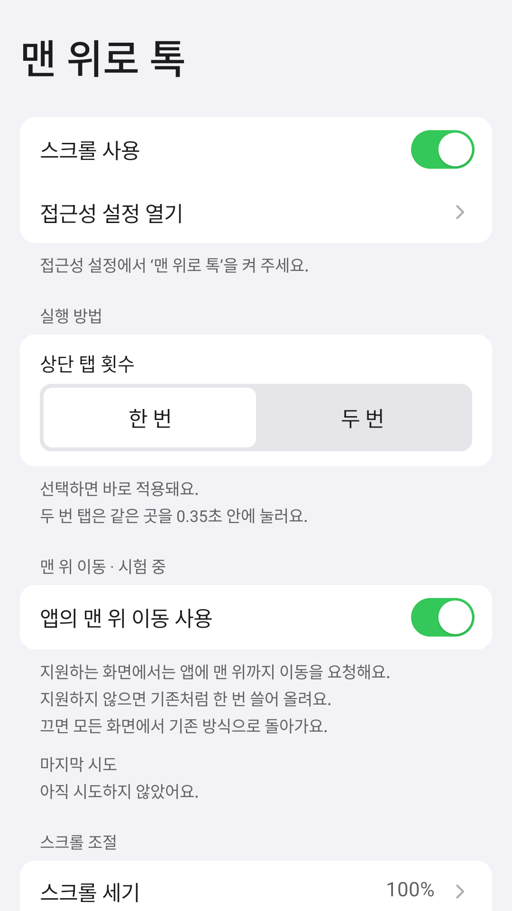</a>
  <a href="docs/images/tap-number.png">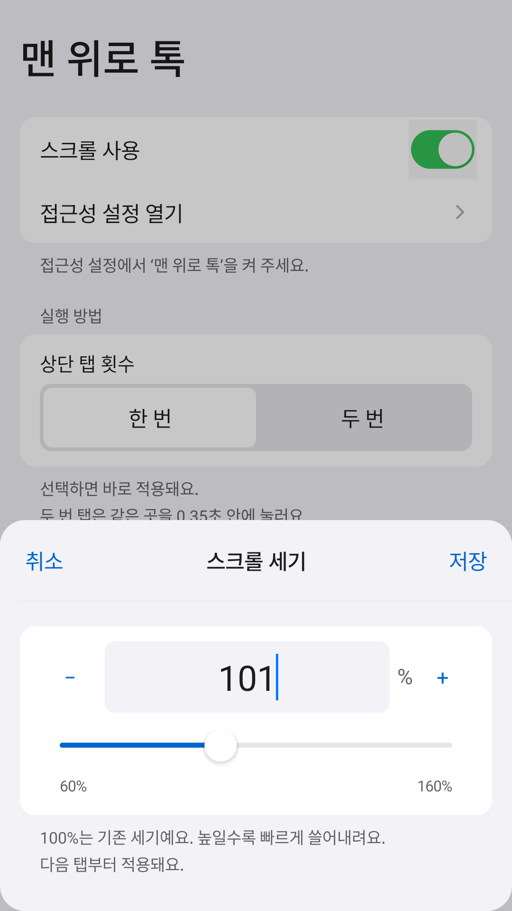</a>
  <a href="docs/images/tap-reset.png">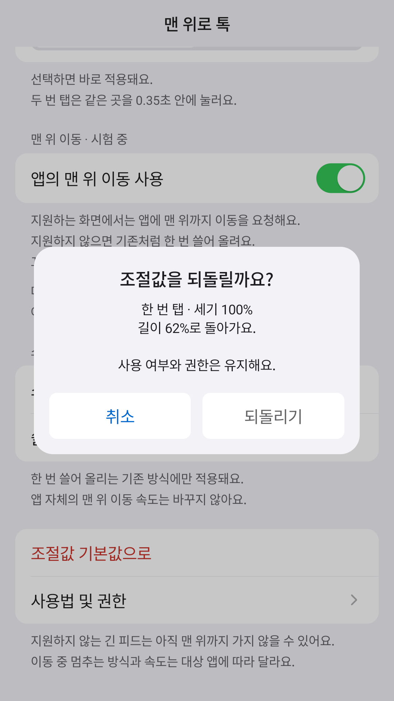</a>

탭 방식 선택 · 스크롤 세기 조절 · 기본값 복원 — 사진을 누르면 크게 볼 수 있습니다.

한 번의 움직임만 보내므로 아주 긴 피드에서는 여러 번 눌러야 할 수 있습니다.
이동 중 화면을 만져 멈출 수 있으며, 상태 표시줄을 아래로 끌면 원래대로 알림창이 열립니다.

## 공휴일 수면 연장

평일인 한국 공휴일에는 원하는 시간까지 방해 금지를 이어 줍니다.
시작·종료 시간은 앱에서 바꿀 수 있습니다.

**[APK 다운로드](https://github.com/chochoq/iphone-to-galaxy/releases/download/v0.0.3/holiday-sleep-0.0.3.apk)** · [사용법](apps/holiday-sleep/)

Android 15 이상 · 캘린더 읽기·방해 금지 접근·알람 및 리마인더 권한 필요

  <a href="docs/images/sleep-home.png">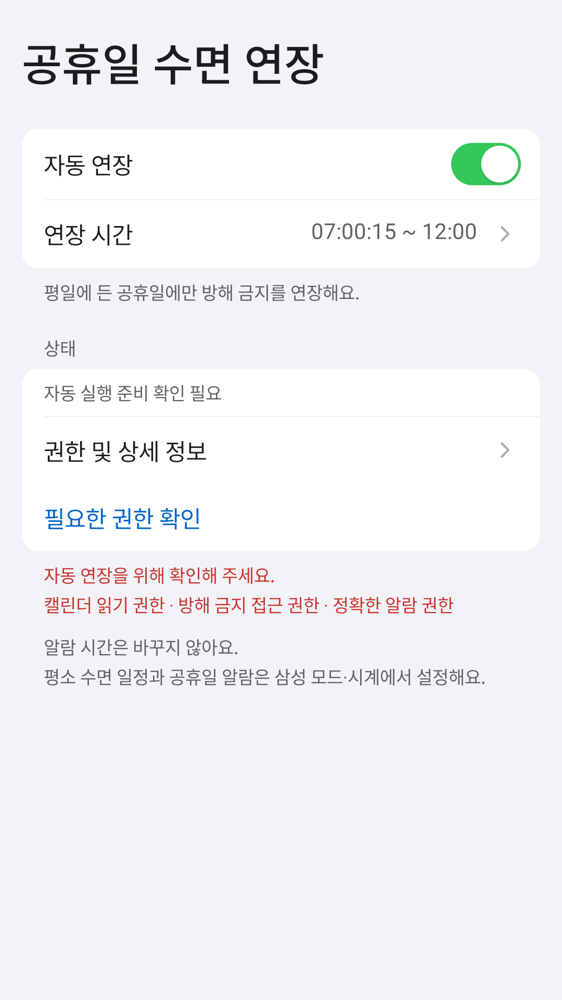</a>
  <a href="docs/images/sleep-time.png">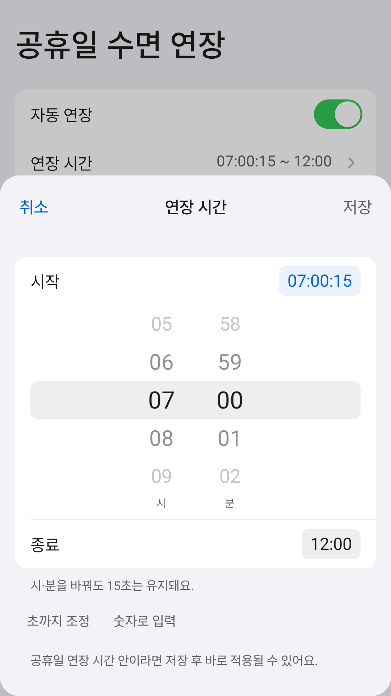</a>
  <a href="docs/images/sleep-seconds.png">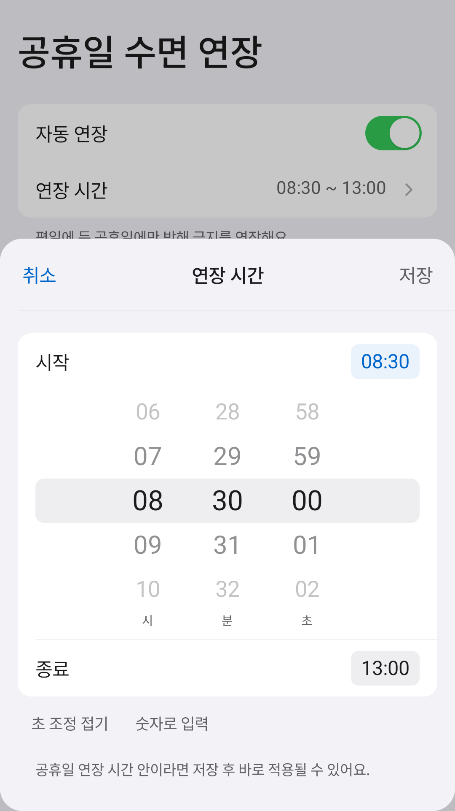</a>

자동 연장 설정 · 시간 고르기 · 초 단위 조절

기상 알람을 만들거나 늦추지는 않습니다.
평소 수면 일정은 Samsung 모드에서, 공휴일 알람 끄기는 시계 앱에서 따로 설정합니다.

## 에어팟 한눈에

AirPods의 왼쪽·오른쪽·케이스 배터리를 앱과 홈·잠금화면 위젯에서 확인합니다.
연결할 때는 제품이 회전하는 큰 카드도 띄울 수 있습니다.

**[APK 다운로드](https://github.com/chochoq/iphone-to-galaxy/releases/download/v0.0.3/airpods-glance-0.0.3.apk)** · [사용법](apps/airpods-glance/)

Android 12 이상 설치 가능 · 연결 후 AAP 잔량 수신은 Android 17 이상 
근처 기기·알림 권한 필요 · 큰 연결 카드는 ‘다른 앱 위에 표시’도 필요

Fold8 연결 카드 미리보기 · 저장된 잔량

  <a href="docs/images/air-home.png">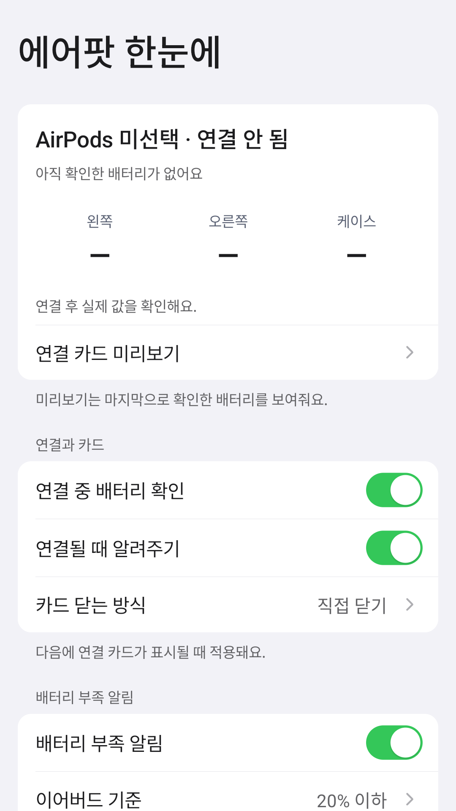</a>
  <a href="docs/images/air-card.png">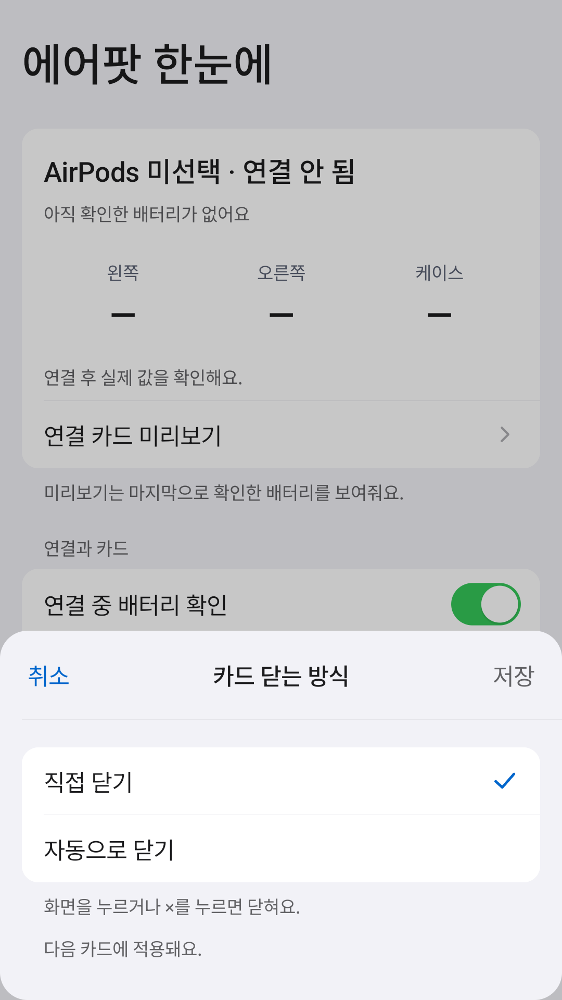</a>
  <a href="docs/images/air-seconds.png">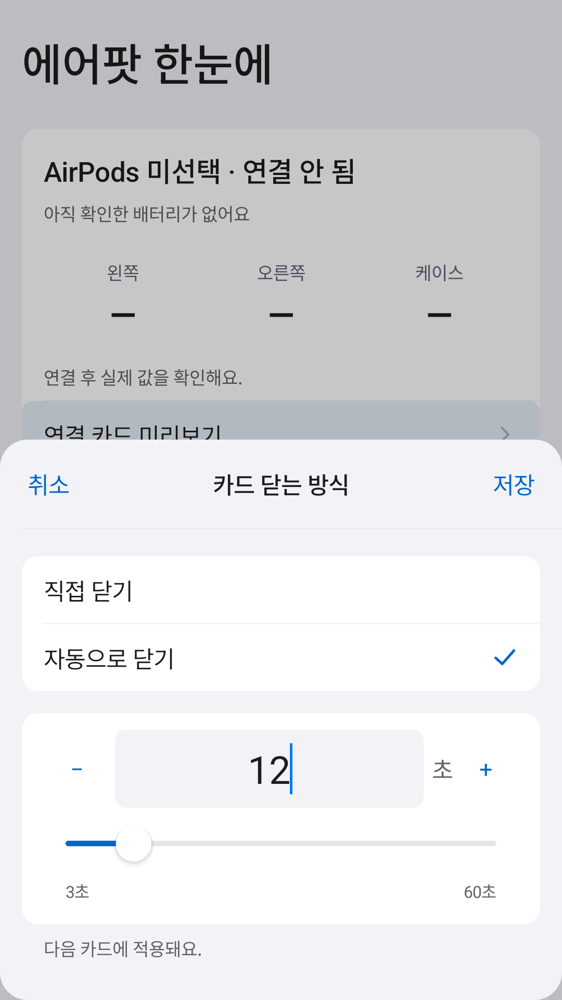</a>

배터리·설정 · 카드 닫는 방식 · 자동 닫기 시간

### 소음 제어 — 다음 업데이트

노이즈 캔슬링·적응형·주변음 허용을 앱에서 선택할 수 있습니다. 
갤럭시에 연결된 AirPods에서 응답을 받으면 현재 모드가 표시됩니다.

<a href="docs/images/air-listening-adaptive.png">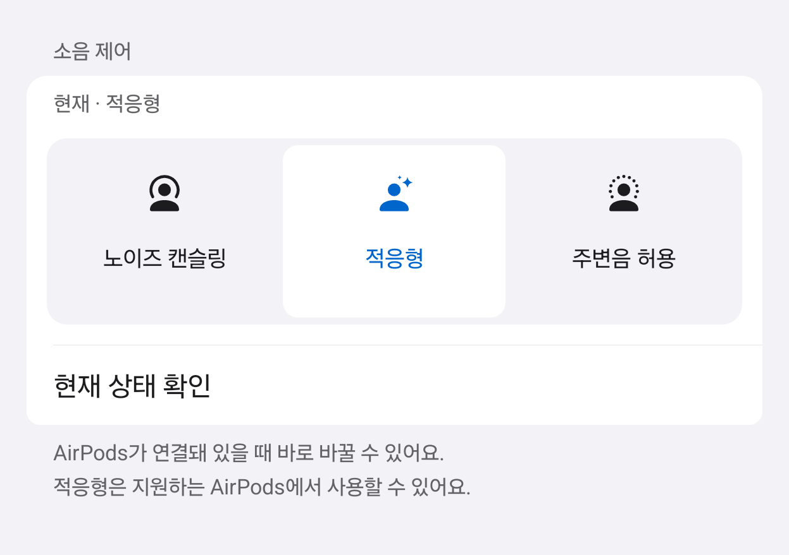</a>

실제 앱 UI의 선택 예시 · [세 모드와 사용법](apps/airpods-glance/#소음-제어--다음-업데이트)

**현재 다운로드 APK에는 아직 없습니다.** Fold8에서 구현·시험을 마쳤고, 다음 업데이트에 포함할 예정입니다.

### 홈 공간에 맞게 위젯 고르기

소음 제어 위젯도 별도로 준비하고 있습니다. **아래 소음 위젯은 아직 다운로드 APK에 없습니다.**

<picture>
  <source media="(max-width: 600px)" srcset="docs/images/air-listening-widgets-light-stacked.png">
  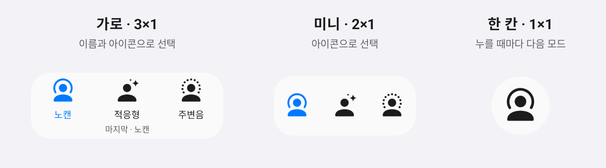
</picture>

3×1·2×1은 원하는 모드를 바로 선택하고, 1×1은 앱에서 정한 순서로 전환하도록 만들었습니다.
한 목록에서 사용할 모드를 체크하고 손잡이를 끌어 순서를 바꿉니다. 노캔↔주변음 두 모드만 남길 수도 있습니다.
[설정 화면과 확인한 범위](apps/airpods-glance/#소음-제어-위젯--개발-중)

위 그림은 실제 UI에 예시 상태를 넣은 화면입니다. 실제 위젯 소음 전환·음악 유지·잠긴 화면 제어는 추가 확인이 필요합니다.

**아래는 현재 APK에서 사용하는 배터리 위젯입니다.**

  <a href="docs/images/widget-wide.png">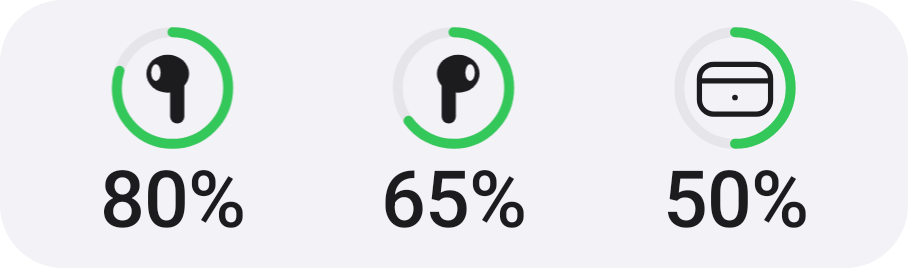</a>
  <a href="docs/images/widget-small.png">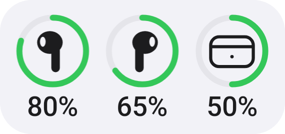</a>
  <a href="docs/images/widget-single.png">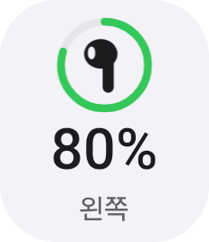</a>

3×1 가로 · 2×1 미니 가로 · 1×1 한 칸 — 숫자는 예시입니다.

앱의 ‘홈 화면에 위젯 추가’에서 크기를 고릅니다.
1×1은 탭하면 왼쪽 → 오른쪽 → 케이스 순으로 바뀌도록 만들었습니다.
삼성 홈에서의 탭 전환·재부팅 후 유지 확인은 아직 남아 있습니다.

홈 위젯에서 모르는 배터리는 ‘—’, 오래된 값은 회색으로 표시합니다.
다른 기종이나 OS 업데이트에서는 잔량 수신이 안 될 수 있습니다. [확인한 범위](compatibility/)

### 잠금화면에서도 한 칸으로

  

Fold8 잠금화면에서 직접 누르는 모습 · [촬영·편집 정보](docs/images/#잠금화면-위젯)

시계 아래 원형 위젯을 누르면 **왼쪽 → 오른쪽 → 케이스** 순으로 바뀝니다.
글자 대신 이어버드·케이스 아이콘으로 구분하고, 마지막으로 본 부품을 기억합니다.

잠금화면을 길게 눌러 편집 → 시계 아래 위젯 → ‘에어팟 한눈에’에서 하나를 고르세요.
‘왼쪽부터·오른쪽부터·케이스부터’는 처음 보여 줄 부품입니다. 세 개를 모두 넣을 필요는 없습니다.

숫자 옆 작은 시계는 마지막으로 받은 잔량이라는 뜻입니다. 누른다고 새 잔량을 측정하지는 않습니다.
Fold8·One UI 9.0에서 확인했으며, 다른 기기에서는 목록에 나오지 않을 수 있습니다.
[잠금화면 위젯 사용법](apps/airpods-glance/#잠금화면에-넣기)

## 앱 설치하기

1. 폰에서 원하는 앱의 **APK 다운로드**를 누릅니다.
2. 받은 파일을 열고, 요청하면 해당 브라우저나 파일 앱에 설치를 허용합니다.
3. 앱을 열어 필요한 권한을 켭니다.

**PC·USB·개발자 옵션은 필요하지 않습니다.** 원하는 앱만 설치하면 됩니다.
설치 출처 허용은 설치 뒤 다시 꺼도 됩니다. [설치와 권한 설정 자세히 보기](docs/INSTALL.md)

설치가 차단되거나 ‘제한된 설정’이라고 나와요

출처를 확인한 APK인지 먼저 살펴보세요. Samsung 보안 위험 자동 차단과 Android 접근성의
제한된 설정은 서로 다른 안내입니다. 필요한 항목만 확인하고 보안 기능을 모두 끄지는 마세요.
회사 관리 폰은 담당자에게 확인해 주세요. [안내별 해결 방법](docs/INSTALL.md)

업데이트할 때 앱을 지워야 하나요?

공식 APK끼리는 삭제하지 않고 업데이트합니다.
직접 빌드한 APK나 개인 테스트 APK는 서명이 달라 설치가 거절될 수 있습니다.
바로 삭제하면 설정을 잃으니 설치 출처부터 확인하세요. [업데이트 안내](docs/INSTALL.md#업데이트와-삭제)

루팅이나 AI 도구가 필요한가요?

필요하지 않습니다. APK를 설치하고 앱별 권한을 허용하면 폰만으로 사용합니다.
소스를 수정하거나 직접 빌드하려는 경우에만 [개발자 문서](docs/GETTING-STARTED.md)를 참고하세요.

## 갤럭시 설정 가이드

별도 제작 앱 없이 갤럭시 설정과 Samsung 공식 도구로 구성하는 방법입니다.

- [수면 일정](recipes/sleep-schedule.md) — 평일·주말 시간과 알람·반복 전화 예외
- [회의 모드](recipes/meeting-mode.md) — Bluetooth 끄기와 녹음 앱 열기
- [한손 제스처](recipes/one-hand-gestures.md) — Good Lock으로 양쪽 손잡이 구성
- [생활 루틴](recipes/home-away-battery.md) — 귀가·외출·배터리 상태에 따른 자동화
- [재난문자](recipes/emergency-alerts.md) — 수신할 알림 종류 선택

일부 가이드는 다른 기기에서 따라 할 수 있도록 세부 절차를 보완 중입니다.
회의 녹음은 회사 규정과 참석자 안내·동의 여부를 먼저 확인하세요.

## 기준 환경

| 구분 | 기기 · 운영체제 |
| --- | --- |
| 익숙한 사용법의 기준 | iPhone 14 Pro · iOS 26.6.1 |
| 실제 사용·기능 시험 | Galaxy Z Fold8 (SM-F971N) · Android 17 · One UI 9.0 · 한국어 |

기능을 시험한 갤럭시는 Fold8 한 대입니다. 다른 기기의 동작과 화면 배치는 확인하지 않았습니다.
위 설정 사진은 개인정보가 없는 Android 가상 기기에서 캡처했습니다.
[기능별 확인 범위](compatibility/) · [사진·영상 출처](docs/images/)

## 함께 만들기

다른 기기에서 써 본 결과나 아이폰에서 옮기며 아쉬웠던 사용법을 Issue로 알려 주세요.
기기·OS·재현 방법을 적되 계정·기기 주소·위치 등 개인정보는 제외해 주세요. PR도 환영합니다.

[기여 안내](CONTRIBUTING.md) · [로드맵](ROADMAP.md) · [문제별 해결 기록](problems/)

직접 빌드하기 · 설계와 검증 기록

JDK 17, Android SDK Platform 36과 Build Tools 36.0.0이 필요합니다.
직접 빌드한 APK는 공식 배포본과 서명이 다른 테스트용 APK입니다.

[빌드·USB 연결](docs/GETTING-STARTED.md) · [공통 UI](shared/android-ui/) ·
[배포 절차](docs/RELEASING.md) · [변경 기록](CHANGELOG.md) · [비슷한 프로젝트](docs/LANDSCAPE.md)

## 개인정보와 라이선스

앱에는 광고·분석 도구가 없으며, 실행 중 서버와 통신하지 않습니다.
권한이 필요한 이유와 데이터 삭제 방법은 각 앱 문서와 [보안 안내](SECURITY.md)에 있습니다.

코드는 GPL-3.0-or-later, 문서는 CC-BY-SA-4.0입니다.
외부 라이브러리와 제품 렌더는 [각 라이선스](LICENSES/README.md)를 따릅니다.
Apple·Samsung의 공식 프로젝트가 아닙니다.
