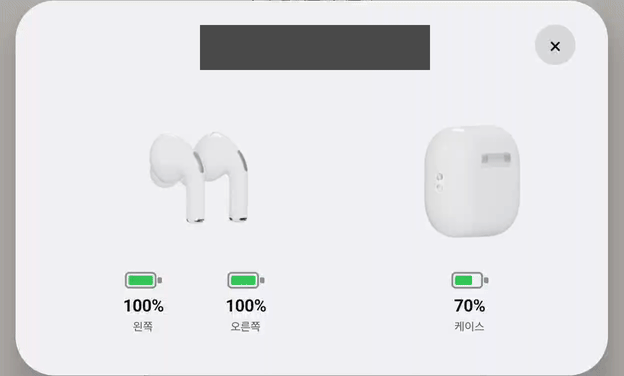

# iPhone to Galaxy

아이폰에서 익숙했던 사용법을 갤럭시로 옮기는 설정 가이드와 Android 앱입니다.

아이폰 3GS부터 아이폰을 쓰다 Galaxy Z Fold8으로 바꾸면서 만들었습니다.
Galaxy 기본 설정과 Good Lock을 먼저 활용하고, 부족한 기능은 직접 만든 앱으로 보완합니다.

## 앱

| 앱 | 기능 |
| --- | --- |
| [맨 위로 톡](apps/tap-to-top/) | 상태 표시줄을 눌러 화면을 위로 스크롤. 탭 방식과 스크롤 세기 조절 |
| [공휴일 수면 연장](apps/holiday-sleep/) | 평일인 한국 공휴일에 방해 금지 연장. 시작·종료 시간 설정 |
| [에어팟 한눈에](apps/airpods-glance/) | AirPods 좌우·케이스 배터리, 홈 화면 위젯, 회전하는 연결 카드 |

- 맨 위로 톡은 긴 피드에서 여러 번 눌러야 할 수 있습니다.
- 공휴일 수면 연장은 시계 알람을 바꾸지 않습니다.
- 에어팟 한눈에는 숨은 Bluetooth API를 사용하므로 기종이나 OS 업데이트에 따라 작동하지 않을 수 있습니다.

### 에어팟 연결 카드

Fold8 실기기 미리보기. 배터리는 저장된 값입니다.
[앱 사용법](apps/airpods-glance/) · [영상 출처](docs/images/)

## 설정 가이드

별도 제작 앱 없이 Galaxy 설정과 Samsung 공식 도구로 구성하는 방법입니다.

- [수면 일정](recipes/sleep-schedule.md) — 평일·주말 시간과 알람·반복 전화 예외
- [회의 모드](recipes/meeting-mode.md) — Bluetooth 끄기와 녹음 앱 열기
- [한손 제스처](recipes/one-hand-gestures.md) — Good Lock으로 양쪽 손잡이 구성
- [생활 루틴](recipes/home-away-battery.md) — 귀가·외출·배터리 상태에 따른 자동화
- [재난문자](recipes/emergency-alerts.md) — 수신할 알림 종류 선택

일부 가이드는 다른 기기에서 따라 할 수 있도록 세부 절차를 보완 중입니다.
회의 녹음은 회사 규정과 참석자 안내·동의 여부를 먼저 확인하세요.

## 시작하기

**설정만 사용할 때:** [설정 가이드](recipes/)에서 원하는 항목을 선택합니다.
PC나 USB 디버깅은 필요하지 않습니다.

**앱을 사용할 때:** 현재 다운로드용 APK는 제공하지 않습니다.
[설치 안내](docs/GETTING-STARTED.md)에 따라 PC에서 직접 빌드하고 USB로 설치합니다.
JDK 17, Android SDK Platform 36, Build Tools 36.0.0과 Platform-Tools가 필요합니다.

루팅이나 AI 도구는 필요하지 않습니다. 설치 후 앱별 권한을 허용하면 PC 연결 없이 사용할 수 있습니다.

## 기준 환경

| 구분 | 기기 · 운영체제 |
| --- | --- |
| 익숙한 사용법의 기준 | iPhone 14 Pro · iOS 26.6.1 |
| 실제 테스트 환경 | Galaxy Z Fold8 (SM-F971N) · Android 17 · One UI 9.0 · 한국어 |

테스트한 Galaxy는 Fold8 한 대입니다. 다른 기기·OS의 동작과 화면 배치는 확인하지 않았으며,
커버 화면과 펼친 화면을 나눈 전체 검증도 남아 있습니다. [기능별 확인 범위](compatibility/)

## 기여와 참고 문서

다른 기기의 동작 결과, 불편한 사용법, 개선안을 Issue나 PR로 알려 주세요.
기기·OS와 재현 방법을 적되, 기기 주소·계정·위치 등 개인정보는 제외해 주세요.

[기여 안내](CONTRIBUTING.md) · [로드맵](ROADMAP.md) · [문제별 해결 기록](problems/) · [비슷한 프로젝트](docs/LANDSCAPE.md)

## 개인정보와 라이선스

앱에는 광고·분석 도구가 없으며, 실행 중 서버와 통신하지 않습니다.
필요한 권한과 데이터 삭제 방법은 각 앱의 README와 [보안 안내](SECURITY.md)에 있습니다.

코드는 GPL-3.0-or-later, 문서는 CC-BY-SA-4.0입니다.
외부 라이브러리와 제품 렌더의 라이선스는 [라이선스 안내](LICENSES/README.md)를 따릅니다.
Apple·Samsung의 공식 프로젝트가 아닙니다.
