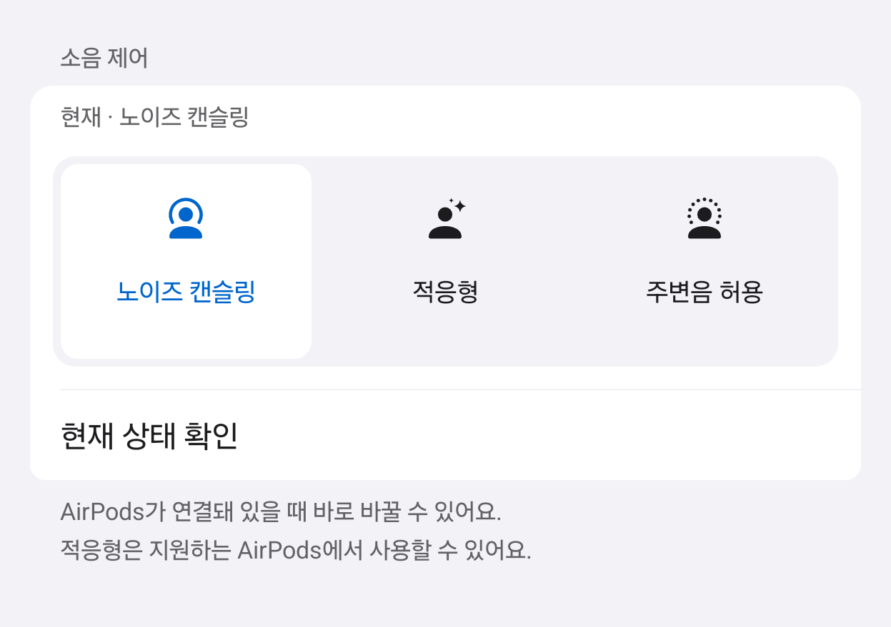
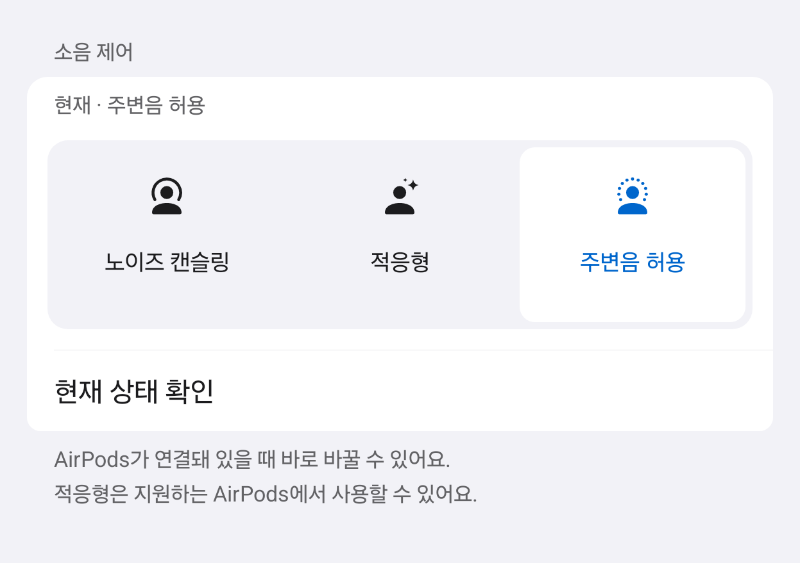

# 에어팟 한눈에

**[APK 다운로드](https://github.com/chochoq/iphone-to-galaxy/releases/download/v0.0.3/airpods-glance-0.0.3.apk)** · [설치 안내](../../docs/INSTALL.md)

Android 12 이상 설치 가능 · 연결 후 AAP 잔량 수신은 Android 17 이상

Galaxy에 연결된 AirPods의 배터리를 앱, 알림과 홈·잠금화면 위젯에서 확인하는 개인용 Android
앱입니다. AirPods가 새로 연결되면 큰 제품 화면도 띄울 수 있습니다. 광고와 분석 기능은 없으며
앱을 사용하는 동안 서버에 접속하지 않습니다.

## 연결 화면 미리보기

Fold8 연결 카드 미리보기 · 저장된 잔량 · [영상 출처](../../docs/images/)

## 소음 제어 — 다음 업데이트

**현재 다운로드 APK에는 아직 없는 기능입니다.** 아래는 다음 업데이트를 준비하며 만든 화면 자료입니다.

AirPods를 갤럭시에 연결한 뒤, 배터리 아래의 ‘소음 제어’에서 원하는 모드를 누릅니다. 
AirPods의 응답을 받으면 선택 표시가 바뀝니다.

### 노이즈 캔슬링

### 적응형

### 주변음 허용

사진은 실제 앱의 소음 제어 영역을 실행한 **선택 상태 예시**입니다.
개인 기기 정보와 알림은 넣지 않았습니다. [화면 자료 출처](../../docs/images/#소음-제어--다음-업데이트)

- 처음에는 현재 모드를 읽습니다. ‘적용 확인 중’일 때는 응답을 기다려 주세요.
- ‘마지막 확인’은 이전에 받은 상태입니다. 현재 상태를 다시 읽으려면 ‘현재 상태 확인’을 누릅니다.
- Android 17 이상에서 연결된 AirPods에 사용합니다. 적응형은 이를 지원하는 AirPods가 필요합니다.
- Fold8·Android 17·One UI 9.0에서 세 모드 전환을 확인했고, 사용자는 음악 끊김이 없었다고 확인했습니다.

다른 휴대폰과 AirPods 모델은 확인하지 않았습니다.
적응 강도 조절·대화 인지·개인 맞춤형 음량 설정은 아직 포함하지 않습니다.

[소음 제어 설계·구현 과정·검증 범위](docs/design/021-listening-controls.md)

## 처음 사용하기

1. 갤럭시 Bluetooth 설정에서 AirPods를 페어링합니다.
2. 앱에서 근처 기기·알림 권한을 허용하고 사용할 AirPods를 고릅니다.
3. 감시를 켭니다. 큰 카드를 원하면 ‘다른 앱 위에 표시’도 허용합니다.

알 수 없는 잔량은 ‘—’로 표시하며 임의의 숫자로 채우지 않습니다.
홈 위젯의 오래되거나 연결이 끊긴 값은 회색으로 표시합니다. 케이스를 닫은 뒤에는 새 잔량이
계속 들어오지 않을 수 있습니다. 이 앱에 케이스 소리 재생 기능은 들어 있지 않습니다.

## 앱에서 조절하기

  
  
  

배터리·설정 · 카드 닫는 방식 · 자동 닫기 시간 — [캡처 환경](../../docs/images/)

- 연결 카드를 직접 닫거나, 3–60초 뒤 자동으로 닫도록 정할 수 있습니다.
- 배터리 부족 알림 기준은 이어버드와 케이스 각각 5–50%에서 고를 수 있습니다.
- 숫자는 저장해야 적용됩니다. 취소하면 이전 값을 유지합니다.
- 기본값 복원은 새 조절값만 되돌리며 기기 선택·권한·기존 기능의 켜짐 상태는 유지합니다.

기본값은 직접 닫기·이어버드 20%·케이스 15%입니다. 닫기 방식은 다음 카드부터, 배터리 기준은
다음 배터리 수신부터 적용됩니다. 설정 화면은 밝은 그룹형으로 바꿨고 새 앱 아이콘을 넣었습니다.

[화면·설정 검증](docs/results/2026-09-08-user-settings.md) · [아이콘 제작 기록](assets/icon/README.md)

## 홈 위젯 고르기

  
  
  

3×1 가로 · 2×1 미니 가로 · 1×1 한 칸 — 숫자는 예시입니다.

앱의 ‘홈 화면에 위젯 추가’에서 가로 3×1, 미니 가로 2×1, 한 칸 원형 1×1을 선택합니다.
3×1·2×1은 좌우·케이스 잔량을 함께 보여주고, 1×1은 한 부품씩 보여줍니다.
1×1은 탭으로 왼쪽 → 오른쪽 → 케이스가 바뀌도록 구현했지만 실제 홈에서의 전환 확인은 남았습니다.

3×1·2×1을 누르면 앱이 열립니다. 홈 격자와 글씨 설정에 따라 실제 크기가 달라집니다.
큰 글씨로 한 칸에 내용이 들어가지 않으면 앱을 여는 방식으로 바뀝니다.
위 세 가지는 홈 화면용입니다. 시계 아래에는 별도의 잠금화면 위젯을 넣습니다.
[위젯 설계·검증 범위](docs/design/017-compact-widgets.md)

## 잠금화면에 넣기

  

Fold8 실기기 시연 · [촬영·편집 정보](../../docs/images/#잠금화면-위젯)

1. 잠금화면을 길게 눌러 편집을 엽니다. 인증을 요청하면 잠금을 풀어 주세요.
2. 시계 아래 위젯 영역에서 ‘에어팟 한눈에’를 고릅니다.
3. ‘왼쪽부터 · 탭 전환’, ‘오른쪽부터 · 탭 전환’, ‘케이스부터 · 탭 전환’ 중 하나를 추가하고 편집을 저장합니다.

한 칸만 있어도 누를 때마다 **왼쪽 → 오른쪽 → 케이스 → 왼쪽**으로 바뀝니다.
세 항목의 차이는 처음 표시하는 부품뿐입니다. 여러 칸을 넣으면 각자 마지막 선택을 기억합니다.
양쪽 이어버드 그림 중 밝은 쪽이 선택한 부품이고, 케이스는 닫힌 케이스 아이콘으로 표시합니다.

숫자 옆 작은 시계는 마지막으로 받은 잔량이라는 뜻입니다. 알 수 없으면 ‘—’로 표시합니다.
위젯을 누르는 동작은 부품만 바꾸며 앱 실행·Bluetooth 연결·새 측정은 하지 않습니다.
기존 배터리 수신이 있을 때 함께 갱신되고, 추가 권한도 필요하지 않습니다.

Fold8·Android 17·One UI 9.0에서 목록·표시를 확인했고, 사용자가 실제 탭 전환을 확인했습니다.
다른 Galaxy와 One UI, AOD 표시와 밝은 배경의 대비는 아직 확인하지 않았습니다.
목록이 보이지 않는 기기에서는 홈 위젯을 사용해 주세요.
[잠금 위젯 설계와 시험 범위](docs/design/018-lock-screen-widgets.md)

## 확인한 환경

- Samsung Galaxy Z Fold8 (SM-F971N)
- Android 17
- One UI 9.0

이 기기에서 AirPods 연결과 음악 재생 유지, 좌우·케이스 잔량과 큰 연결 카드를 확인했습니다.
작은 위젯 세 종류는 커버 화면의 추가창과 홈 표시를 확인했습니다.
1×1의 홈 탭 전환·재부팅 후 선택 유지, 펼친 화면과 다른 런처 시험은 남아 있습니다.
다른 Galaxy, Android와 One UI에서는 잔량 수신이나 화면 배치가 달라질 수 있습니다.

## 지금까지 확인한 결과

- JVM 핵심 검사 263,039개를 통과했습니다. 입력 조합 검사 횟수이며 실제 연결 횟수는 아닙니다.
- APK 빌드, 서명과 권한 검사를 통과했습니다.
- 잠금 위젯 모델 검사 7,388개, Android 렌더 288사례와 탭 전달·개별 선택 저장 검사를 통과했습니다.
- AirPods를 세 번 새로 연결해 AAP 배터리 수신과 30초 동안의 음악 연결 유지를 확인했습니다.
- 왼쪽 이어버드를 착용하고 오른쪽을 케이스에 둔 상태에서 좌우 92%, 오른쪽 충전 중, 케이스 84%를 확인했습니다.
- Mac의 AirPods 자동 전환을 제한한 뒤 Galaxy에 자동으로 연결되는 것을 확인했습니다.
- 기본 설정에서는 연결 화면이 본문이나 닫기 버튼을 누를 때까지 남습니다. 자동 닫기는 설정한 시간이 지나면 닫히며, 연결 해제 시 정리는 그대로 유지합니다.
- 프레임 사이를 변형해 만든 첫 애니메이션은 제품 모양이 일그러져 폐기했습니다. 현재 영상은 CC BY 4.0 3D 모델을 180장에서 직접 렌더링했습니다.
- 수면 모드 중 무음 연결 화면은 설치를 마쳤지만 새 물리 연결로 한 번 더 확인해야 합니다.

## 다시 빌드하고 검사하기

~~~sh
./test-core.sh
sh ./test-listening.sh
./build.sh
./verify-apk.sh
~~~

Android SDK Platform 36, Build Tools 36.0.0, JDK, curl과 unzip이 필요합니다. SDK가 기본 위치에
없다면 ANDROID_SDK_ROOT를 지정합니다.

빌드할 때 LSPosed HiddenApiBypass 6.1을 Maven Central에서 내려받고 SHA-256 값이 맞는지
확인합니다. APK 안에는 HiddenApiBypass의 Apache 2.0 전문과 AirPods 렌더의 CC BY 4.0 전문,
저작자 고지도 함께 들어갑니다.

직접 빌드한 APK는 개발자의 테스트용 키로 서명됩니다. 공식 APK는
[GitHub Releases](https://github.com/chochoq/iphone-to-galaxy/releases/tag/v0.0.3)에서 받습니다.
[폰에서 설치하기](../../docs/INSTALL.md) · [배포용 서명과 업데이트](../../docs/RELEASING.md)

APK는 Android 12 이상에 설치할 수 있지만, 연결 후 AAP 배터리를 읽는 경로는 Android 17 이상에서만
켜집니다. 이전 버전의 BLE 배터리 수신은 검증하지 않았습니다.

설계와 판단은 [설계 인덱스](docs/design/INDEX.md), 구현 항목은 [작업 기록](docs/tasks/TASKS.md),
기기에서 시험한 내용은 docs/results/에 있습니다.

비교에 사용한 iPhone 촬영물과 Apple 공식 이미지, 다른 앱의 APK는 재배포 권리를 확인할 수 없어
저장소에 넣지 않았습니다.

## 권한과 개인정보

인터넷, 위치, 접근성과 마이크 권한은 요청하지 않습니다. 다른 앱 위 표시 권한은 큰 연결 화면을
보여주는 기능을 켰을 때만 필요합니다. Bluetooth 주소와 원시 패킷은 화면이나 로그에 남기지
않습니다.

CAPod, Podsify와 GreenPods는 AirPods 통신 방식을 교차 확인하는 자료로만 살펴봤으며 코드는
복사하지 않았습니다.

제품 회전 영상은 polyman의 ‘Airpods Pro With Magsafe Charging Case Ios15’ 3D 모델을 바탕으로
만들었습니다. 저작자와 라이선스는
[THIRD_PARTY_NOTICES.md](THIRD_PARTY_NOTICES.md)에 표시했습니다.

되돌리려면 앱에서 감시와 큰 연결 화면을 끕니다. 다른 앱 위 표시, 알림과 근처 기기 권한을
철회하고 위젯을 지운 뒤 앱을 삭제합니다. Bluetooth 페어링은 자동으로 삭제하지 않습니다.
기능의 위험과 한계는 [문제 문서](../../problems/airpods-on-galaxy.md)에 있습니다.
